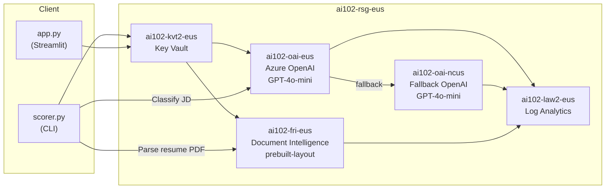

# Week 2 — Job Opportunity Scorer

Classify job descriptions against your resume into 5 actionable buckets using Azure Document Intelligence and Azure OpenAI.

## Architecture



### Flow

1. **Resume Upload** — PDF → Azure Document Intelligence (`prebuilt-layout`) → raw text → Azure OpenAI → structured `ResumeProfile`
2. **Job Classification** — Resume profile + job description → Azure OpenAI → category + confidence + reasoning + action
3. **Multi-region fallback** — Primary: East US (`ai102-oai-eus`). If unavailable, retry on North Central US (`ai102-oai-ncus`)

## Classification Categories

| # | Category | When to Use | Action |
|---|----------|-------------|--------|
| 1 | **Strong Fit — Apply Now** | 80%+ skills match, right seniority | Draft tailored application this week |
| 2 | **Stretch Role — Worth a Shot** | 60-79% match, growth opportunity | Apply with narrative bridging the gap |
| 3 | **Interesting — Not Now** | Great company, wrong timing/location | Save to watchlist, revisit in 30 days |
| 4 | **Needs More Research** | Vague JD, unclear scope | Research company before committing time |
| 5 | **Not Relevant** | Wrong stack, spam, off target | Archive immediately |

## Setup

### 1. Infrastructure

```bash
cd week2-job-scorer/infra

# Copy and edit variables
cp terraform.tfvars.example terraform.tfvars
# Edit terraform.tfvars with your subscription_id

terraform init
terraform plan
terraform apply

# If reusing the Week 1 resource group, import it first:
terraform import azurerm_resource_group.main /subscriptions/<SUB_ID>/resourceGroups/ai102-rsg-eus
```

### 2. Python Environment

```bash
cd week2-job-scorer
python -m venv .venv
source .venv/bin/activate
pip install -r requirements.txt
```

### 3. Azure Authentication

Ensure you're logged in with a principal that has:
- **Key Vault Secrets Officer** on `ai102-kvt2-eus`
- **Cognitive Services User** on OpenAI + Document Intelligence resources (for `--auth identity` mode)

```bash
az login
```

### 4. Run — CLI

```bash
# Single job description
python -m src.scorer --resume data/my_resume.pdf --job "paste JD text here"

# Batch mode
python -m src.scorer --resume data/my_resume.pdf --jobs data/sample_jobs/

# With output file
python -m src.scorer --resume data/my_resume.pdf --jobs data/sample_jobs/ --output data/evaluation/results.json

# Using managed identity (no API keys)
python -m src.scorer --resume data/my_resume.pdf --job "JD text" --auth identity
```

### 5. Run — Streamlit UI

```bash
streamlit run app.py
```

### 6. Run — Evaluation

```bash
# Unit tests (no Azure needed)
pytest tests/test_scorer.py -v

# Full evaluation (requires deployed Azure resources)
python -m tests.test_scorer --resume data/my_resume.pdf
```

## AI-102 Exam Mapping

| Exam Objective | How This Project Covers It |
|---|---|
| **Plan and manage an Azure AI solution** | Terraform IaC, Key Vault secret management, multi-region deployment, diagnostic settings |
| **Implement document intelligence solutions** | Document Intelligence `prebuilt-layout` for PDF resume parsing |
| **Implement generative AI solutions** | Azure OpenAI `chat.completions` with structured outputs (JSON mode + Pydantic) |
| **Secure Azure AI services** | `DefaultAzureCredential` + API key paths, Key Vault RBAC, secret rotation strategy |
| **Monitor Azure AI services** | Diagnostic settings (Audit, RequestResponse, Trace) → Log Analytics for all 3 cognitive resources |

## Key Design Decisions

### Why Azure OpenAI vs. Azure AI Language Custom Classification?
Azure AI Language custom classification requires labeled training data and a training pipeline — overhead that doesn't justify the 5-category system here. Azure OpenAI with prompt engineering is faster to iterate, handles nuanced reasoning, and produces explanations. For a production system with thousands of daily classifications and strict SLAs, custom classification might win on latency and cost.

### Why Dedicated Document Intelligence vs. Multi-Service Account?
The Week 1 multi-service account (`ai102-cog-eus`, kind: `CognitiveServices`) already includes Form Recognizer. We create a dedicated resource (`ai102-fri-eus`, kind: `FormRecognizer`) to demonstrate both provisioning patterns for the exam. The code could use either endpoint.

### Auth Pattern: Entra ID vs. API Key
Both are implemented. API key flow: `DefaultAzureCredential` → Key Vault → retrieve key → pass to AI service SDK. Identity flow: `DefaultAzureCredential` → token provider → pass directly to AI service SDK. The identity path is more secure (no secrets to rotate) but requires RBAC role assignments on each AI resource.

### Multi-Region Fallback
Primary endpoint in East US, fallback in North Central US. Simple try/except — if the primary call fails for any reason (429 rate limit, 503 outage), retry on fallback. Demonstrates resilience patterns relevant to the exam's "plan and manage" objective.

### Structured Outputs
Uses `client.beta.chat.completions.parse()` with a Pydantic model for type-safe, schema-validated responses. Falls back to `response_format: json_object` + manual Pydantic validation if the API version doesn't support structured outputs.

## Azure Resources

| Resource | Name | Kind | SKU | Region |
|----------|------|------|-----|--------|
| Resource Group | `ai102-rsg-eus` | — | — | East US |
| Azure OpenAI (primary) | `ai102-oai-eus` | OpenAI | S0 | East US |
| Azure OpenAI (fallback) | `ai102-oai-ncus` | OpenAI | S0 | North Central US |
| Document Intelligence | `ai102-fri-eus` | FormRecognizer | S0 | East US |
| Key Vault | `ai102-kvt2-eus` | Key Vault | Standard | East US |
| Log Analytics | `ai102-law2-eus` | Log Analytics | PerGB2018 | East US |

## Cost Estimate

| Resource | Pricing | Est. Monthly (lab use) |
|----------|---------|----------------------|
| Azure OpenAI GPT-4o-mini | ~$0.15/1M input tokens, ~$0.60/1M output | < $1 (eval run ~50 calls) |
| Document Intelligence | $1.50 per 1000 pages (S0) | < $0.10 (1-2 resumes) |
| Key Vault | $0.03/10K operations | < $0.01 |
| Log Analytics | ~$2.76/GB ingested | < $0.50 |
| **Total** | | **< $2/month** |

Teardown with `terraform destroy` when not in use to avoid idle costs.

## Evaluation

Sample dataset: 50 job descriptions (10 Strong Fit, 10 Stretch, 10 Interesting, 8 Needs Research, 12 Not Relevant).

Metrics captured:
- Overall accuracy
- Per-category precision, recall, F1
- Confusion matrix
- Confidence calibration (does "high confidence" correlate with correctness?)

Results are written to `data/evaluation/results.json` after each eval run.
