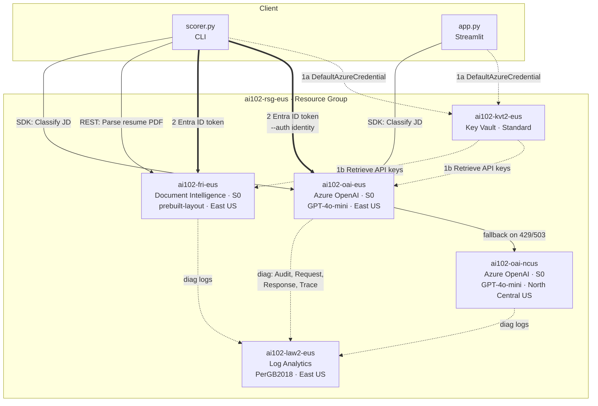

# Architecture Diagram

## Legend

| Line Style | Meaning |
|---|---|
| `-- solid thin --` | SDK / REST data calls (current build) |
| `== solid thick ==` | Entra ID auth path (identity mode) |
| `-. dashed .-` | Key Vault secret retrieval and diagnostic log flow |
